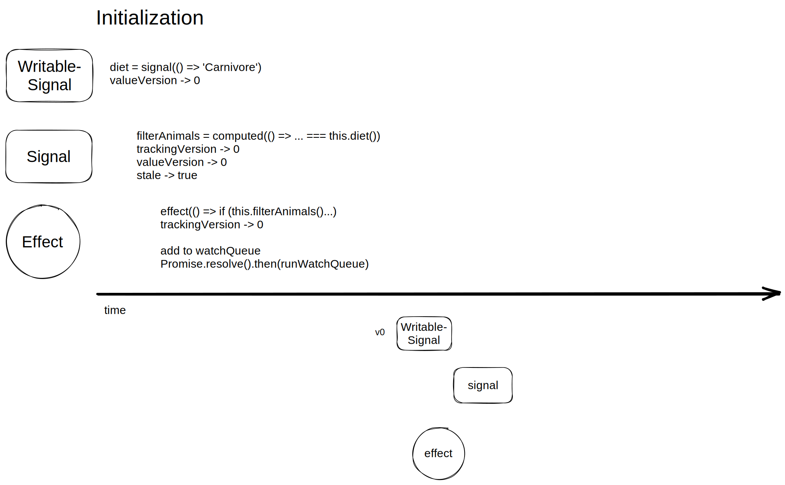
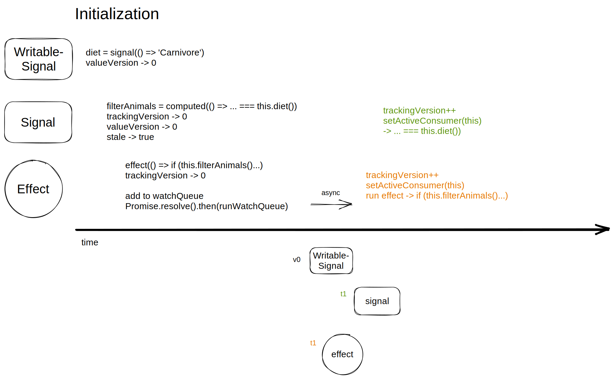

# Angular Signals

---
## Content

- What are Angular Signals?
- Demo
- How are Signals initialized?
- Why does Angular want Signals?
- Why doesn't Angular just use RxJs?

---

---

---

---

---

---

---

---

---

---

---

---

---
## Demo

---

---

---

---

---

---

---

---

---

---
## Why does Angular want Signals?

Because of their high level goals.
- Fine-Grained Reactivity in Angular
- Path towards zoneless applications
- Simplification of framework concepts
- Interoperability with RxJs

Source: [RFC](https://github.com/angular/angular/discussions/49685)

---
## Fine-Grained Reactivity
- Comparison zone.js vs Signals

---

---

---

---

---
## Signal vs RxJs

RxJs

- Declare how streams of asynchronous data is handled
- Asynchronous
- Is not glitch free (intermediate state)
- Push changes directly to subscribers

---
## Signal vs RxJs

Signal

- Notify dependencies of changes
- Synchronous
- Is glitch free (no intermediate state)
- Push changes to dependencies
- Dependencies pull changes

---
## RxJs

---
## Signal

